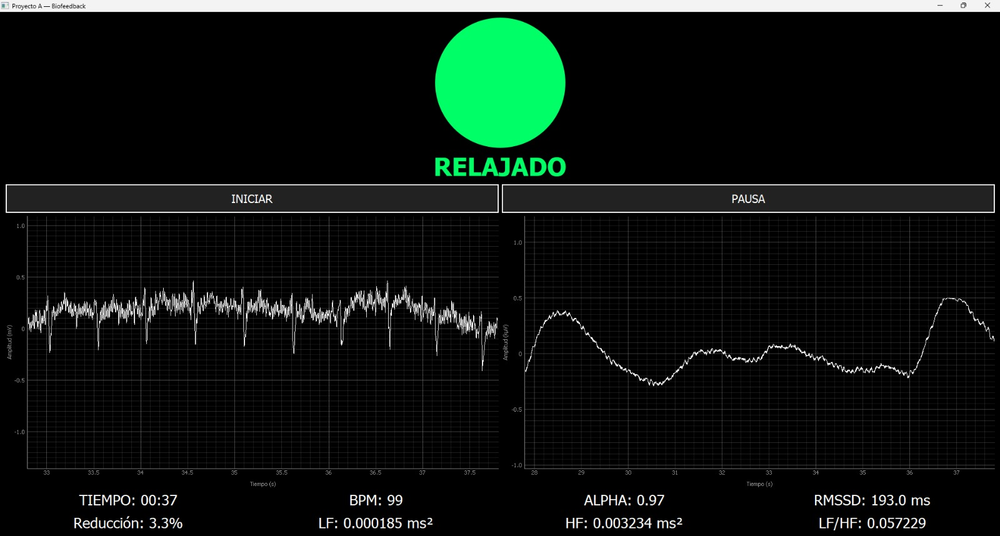
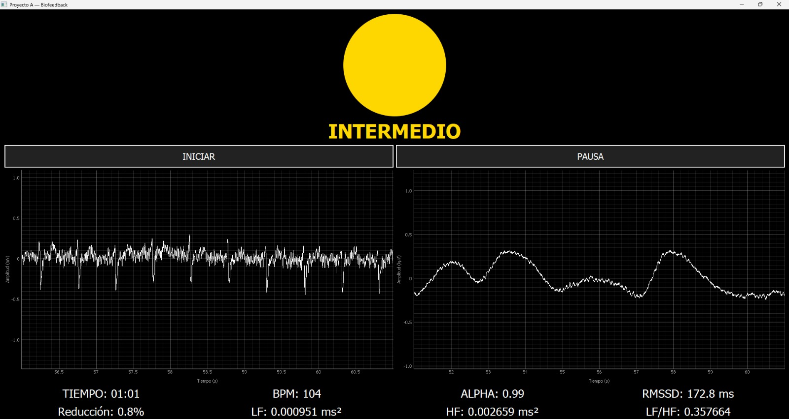
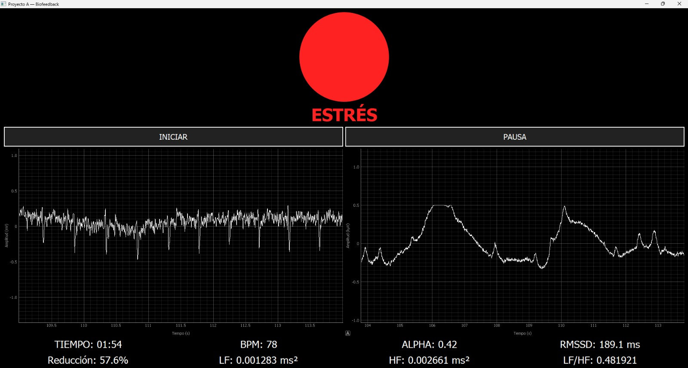

# Sistema-de-biofeedback-para-el-control-del-estrés-ECG-EEG-_EquipoAJX

# Integrantes
- Alex Arturo Reza Castillo
- Ximena Alejandra Merlín Martínez
- Javier Del Angel Del Angel

# Estructura 
Hardware
Software 
Reporte
Readme.md 

# Descripción
Este trabajo consta de un sistema de biofeedback que detecta el estado de relajación y la reducción de este estado, por medio de señales EEG Y ECG.
Mediante las señales obtenidas previamente, se les aplica un procesamiento digital, se adquieren caracteristicas fisiologicas, para después mostrarlas en la interfaz, a su vez con esos mismos datos generar un semáforo mostrando el estado del sujeto.

# Objetivos
Generar una interfaz con las siguientes especificaciones:
- Detectar picos R y obtener el intervalo RR
- Calcular la metrica HRV mediante el calculo de RMSSD:
- Obtener la relación LF/HF

- A la señal de EEG extarer la potencia Alpha (8-13Hz)
- Clasificar el estado del usuario, mediante 3 colores:
    * Rojo--> Estrés
    * Amarillo--> Intermedio 
    * Verde--> Relajación

# Hardware usado 
- Sistema Biopac
- Electrodos EEG
- Electrodos ECG
- Camputadora o laptop para procesamiento de las señales

# Requisitos para el funcionamiento del software 

Python 3.11+
Instalar las siguientes librerías:
- Bioread
- numpy
- scipy
- pyqtgraph
- PyQt5
Para instalarlas es necesario abrir el terminar de python y escrirbir
pip install bioread numpy scipy pyqtgraph PyQt5

# Archivos necesarios
Colocar en la misma carpeta:
- Lankicalibra.acq
- Lankimedido.acq
- Software_Semaforodenivelesderelajación.py

# Ejecución 
Para poder ejecutar el codigo debe de entrar el usuario a la carpeta del software ya descargada y ejecutar, si el usuario gusta cambiar los archivos de datos tomados de igual forma se colocaran varios archivos acq para que este pueda realizar varias pruebas.
Para poder utilizar las diferentes tomas de datos que se encuentran en la carpeta, este debe de modificarse en el código a partir de la linea 438 para poder colocar datos adquridos en el formato acq. Su calibración y sus señales a procesar. El archivo de calibración de cambia en la linea 442 y el archivo a procesar en la 447
| ![Captura ubicacion]Ubicación_codigo.png)|

## Procesamiento que se implementa 
### EEG
- filtrado de la señal 1-40 Hz
- Extracción de la banda Alpha
- Cálculo PSD mediante el método de Welch

### ECG
1. Filtrado 5–25 Hz
2. Detección de picos R y calcular los intervalos RR
3. Cálculo RMSSD y la HRV
4. Cálculo LF/HF

### GUI
La interfaz gráfica muestra al usuario:
- Estado del semáforo
- La señal de ECG
- La señal de EEG
- Tiempo transcurrido
- BPM
- La potencia Alpha
- La raíz cuadrada de la media de las diferencias sucesivas(RMSSD)
- LF
- HF
- la diferencia entre LF/HF
-  la relación de la potencia alpha actual con la de la medida de calibración en porcentaje

|  |  |  |
